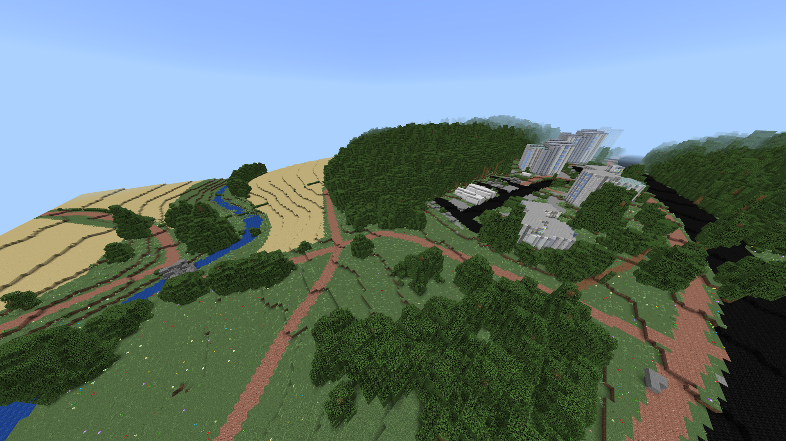

# CityMinecraft

## WORK IN PROGRESS!
Program to generate the city of Turku in minecraft using open data from multiple sources
including open data offered by Turku and OpenStreetMap.

This program could maybe be used for other cities, 
but that would require lots of configuration.

Documentation can be found in the GitHub wiki (coming soon)

Images:

## Running the program (TODO)

java -XX:StartFlightRecording,filename=flight.jfr,maxage=1h,maxsize=200m,duration=600000s -ea -Xmx10g -jar Main/target/Main-1.0-SNAPSHOT-bin.jar run inputData/templates/run-options-template.json inputData/lasFiles --copy --log WARN --end SCHEMATIC --start GML --overwrite true
## Contributing

Make a pull request

## Used libraries:
- https://github.com/mreutegg/laszip4j (reading lidar data)
- https://github.com/geotools/geotools (reading osm data)
- https://github.com/Querz/NBT (writing minecraft schematics)
- https://github.com/Amulet-Team/Amulet-Core (writing minecraft worlds)
